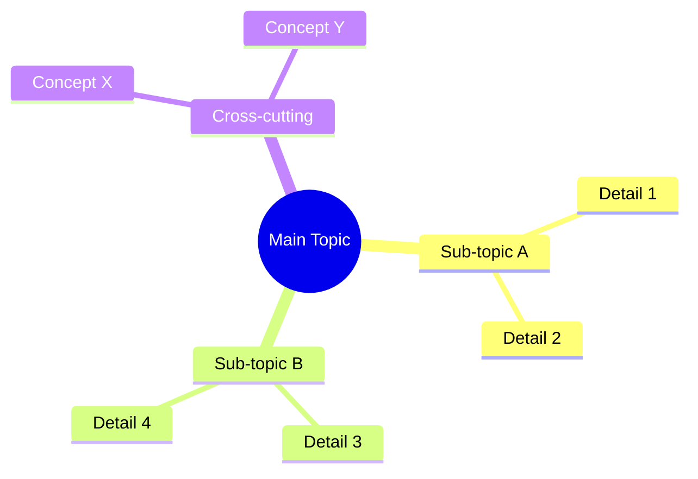

## When to Use
Activate when user says: `mindmap`, `แผนผัง`, `diagram`, `ความสัมพันธ์`, `map`

## Workflow

### 1. Read source
- Read the file or content the user wants mapped
- If no source specified, use recent conversation context

### 2. Extract concepts & relationships
Identify:
- Root topic (center of map)
- Sub-topics (2–3 levels deep)
- Cross-relationships (depends on, extends, alternative to)
- Categories / groupings

### 3. Generate mermaid mindmap
Use this format:
```markdown
## {Topic} — Mindmap


```

Keep mindmap focused — max 15–20 nodes. Too complex = not useful.

### 4. Save & reply
- Save to `notes/personel/{topic}-mindmap.md`
- Display the diagram inline
- Reply: `🗺️ แผนผังแล้ว: notes/personel/{topic}-mindmap.md`
